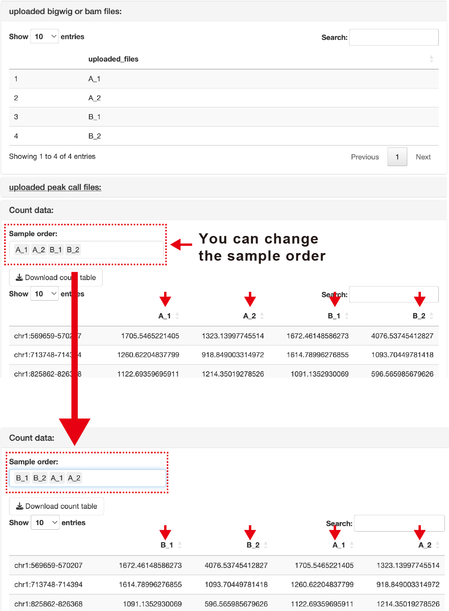
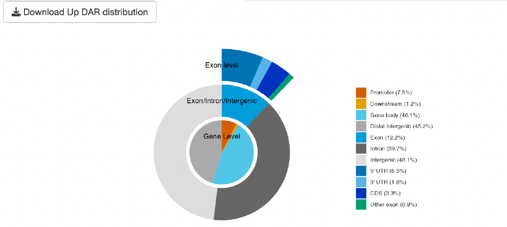
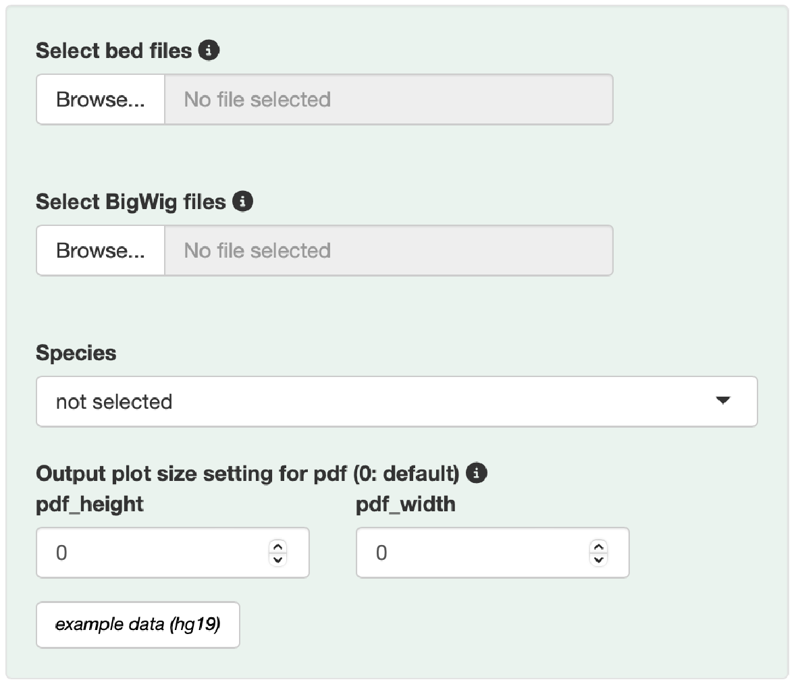
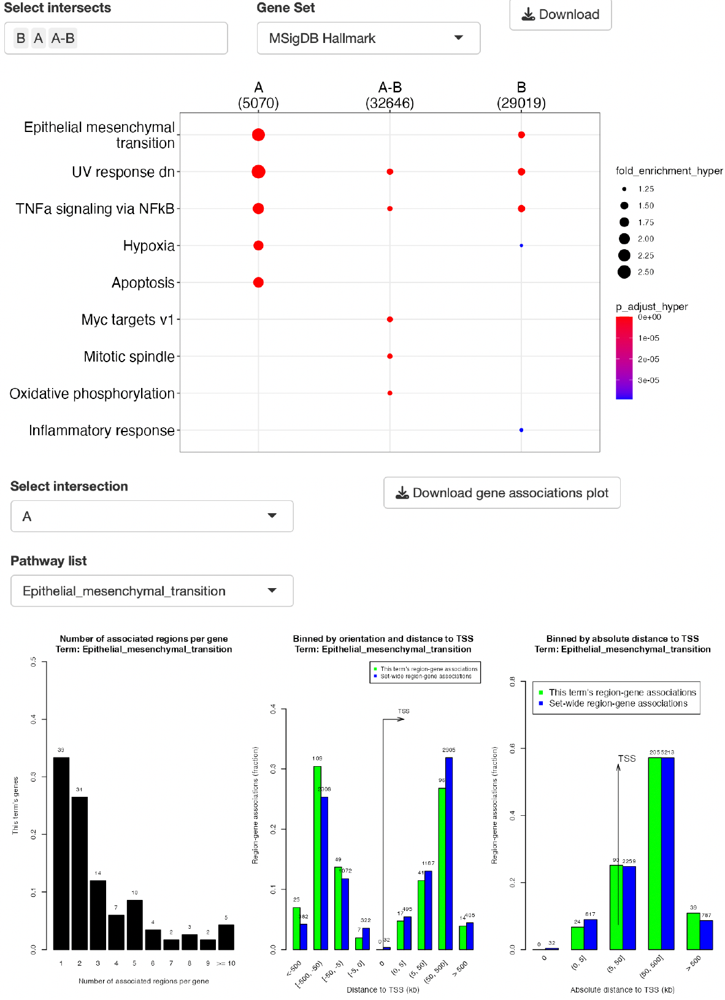
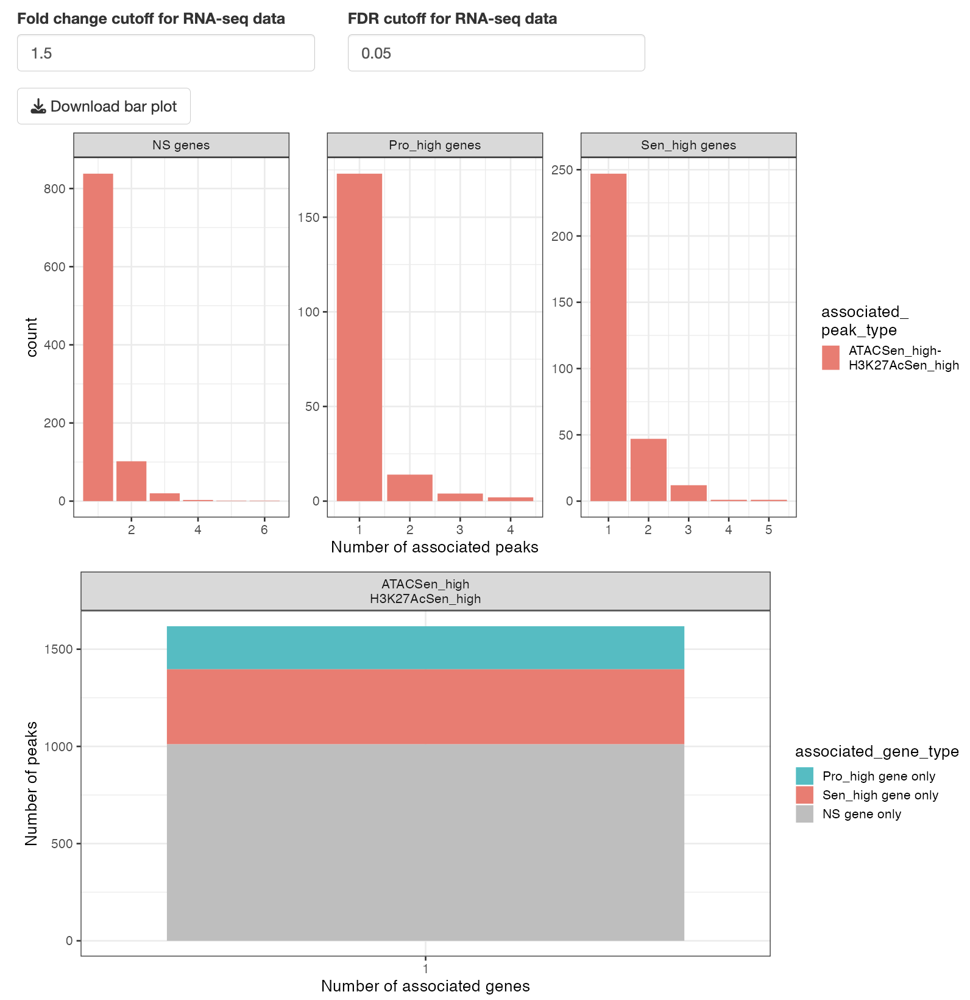
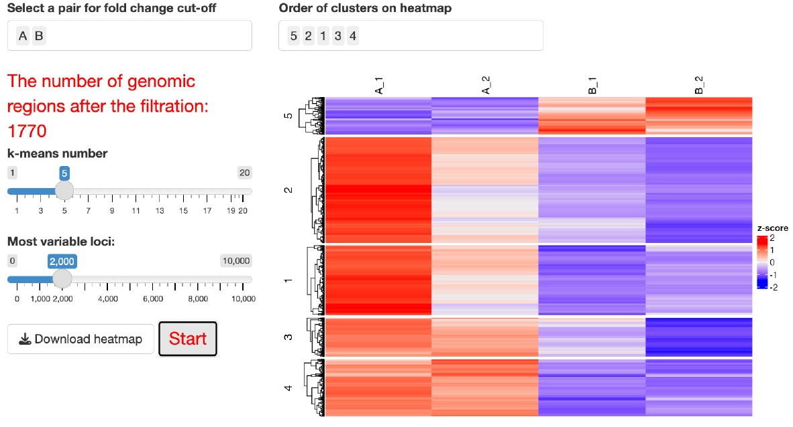
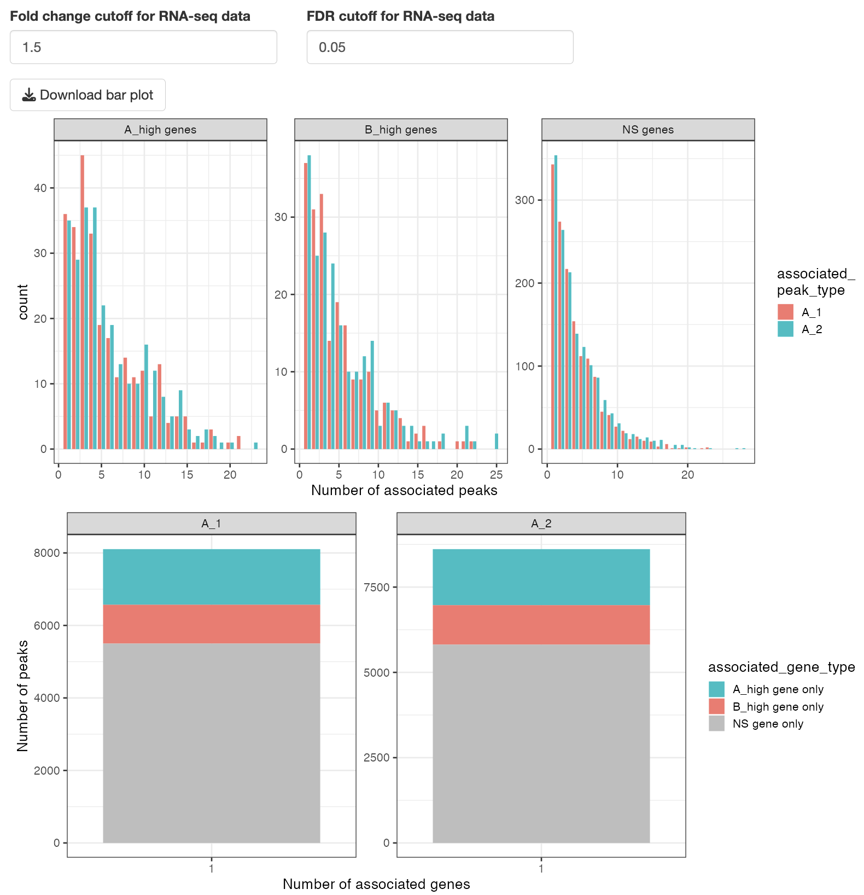
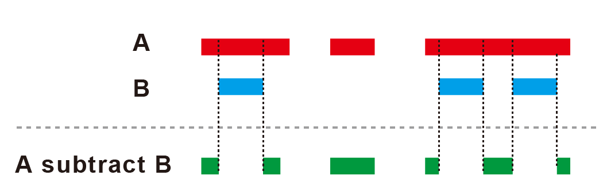
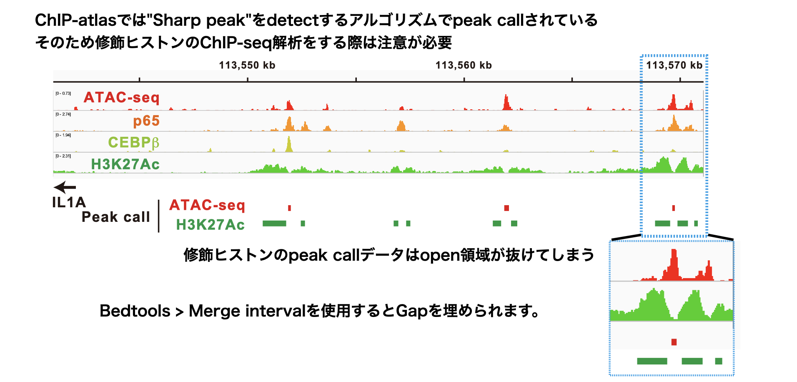

```{r setup, include=FALSE}
source("global.R")
library(Gviz)
knitr::opts_chunk$set(echo = TRUE)
```

# 概要

{#id .class width=100%} <br><br>

EpigenomeChefは、ChIP-seqやATAC-seqにより得たカバレッジデータ(.BigWig)及びピークコールデータ(.bed)を自動的に統計解析・可視化するウェブアプリです。<br>
単一のデータセットの解析だけでなく、複数のデータセットの結果を統合解析(エピゲノムデータの統合解析)することも可能です。<br>
ChIP-seq, ATAC-seq, Bisulfite-seqのデータベースである**ChIP-atlas**からダウンロードしたデータをそのまま使用することができます(事前にファイル名を変更する必要があります。詳細はInput fileの共通ルール・注意点)。
また、RNA-seqデータから得た遺伝子発現変動(DEG)解析結果を同時にアップロードすることで、トランスクリプトーム解析との統合解析も可能です。<br><br>
EpigenomeChefは、Docker imageをインストールすることで使用可能です。<br>
**0.（Docker環境がない場合）Dockerのインストール**<br>
インストール方法は以下のページが詳しいです。<br>
Windows:[https://sukkiri.jp/technologies/virtualizers/docker/docker-win_install.html](https://sukkiri.jp/technologies/virtualizers/docker/docker-win_install.html)<br>
Mac:[https://matsuand.github.io/docs.docker.jp.onthefly/desktop/mac/install/](https://matsuand.github.io/docs.docker.jp.onthefly/desktop/mac/install/)<br><br>

**1. EpigenomeChefのインストール**（一度実行すれば以後必要ありません） <br> 
注意点：HOMERはリファレンスゲノムのファイルサイズが大きいため、リファレンス毎にdocker imageを分割しています。解析したいデータセットの種に対応するdocker imageをインストールしてください。<br>
HOMER human (hg19)対応 
```
docker pull kanetoh1030/shiny-epigenomechef:hg19v0.0.1
```

HOMER mouse (mm10)対応 
```
docker pull kanetoh1030/shiny-epigenomechef:mm10v0.0.1
```

**2. コンテナの作成**（実行コマンドの入力）<br>
HOMER human (hg19)対応 
```
docker run --rm -p 3838:3838 kanetoh1030/shiny-epigenomechef:hg19v0.0.1
```
HOMER mouse (mm10)対応 
```
docker run --rm -p 3838:3838 kanetoh1030/shiny-epigenomechef:mm10v0.0.1

```
**ブラウザで[http://localhost:3838](http://localhost:3838)を立ち上げる**。<br>
解析終了後はコンテナを削除してください。<br>

If you need help, please create an issue on [Github](https://github.com/Kan-E/EpigenomeChef/issues) or [contact us](mailto:kaneto@kumamoto-u.ac.jp){.email}. <br>


本アプリは以下のセクションにより構成されます。<br>

- **Pair-wise** (２群間比較のdifferential accessible region解析)

- **Venn diagram** (ゲノム領域の位置情報の重ね合わせの解析)

- **Clustering** (クラスタリング解析、k-means clusteringを用いたゲノム領域の分類・解析)

- **Enrichment viewer** (ゲノム領域の機能解析・モチーフ解析)

- **More**（その他の便利機能やReferenceなど）

アプリはメニュー、セッティングパネル、アウトプットパネルの3種類のパネルで構成されています。<br>
各セクションはアプリ上部のメニューボタンをクリックすることで移動できます。<br>
解析を実行するファイルは、セッティングパネルからアップロードすることができます。<br>
解析は、アウトプットパネルのタブパネルをクリックすることで実行されます。<br><br>
{#id .class width=90%} <br>

---

# Input fileの共通ルール・注意点

#### 拡張子

カバレッジデータはBigWig file (.BigWig or .bw)、またはBam file (.bam)が利用可能です。
ピークコールデータはnarrowPeak file (.narrowPeak)、またはbed file (.bed)が利用可能です。
RNA-seq DEG result fileはタブ区切りtxt file (.txt)、カンマ区切りcsv file (.csv)、エクセルファイル (.xlsx)が利用可能です。<br><br>

#### BigWig fileの形式

NormalizeされたBigWig file (例: Reads per million (RPM))を使用してください。

#### BigWig fileおよびBam fileのファイル名

ファイル名はFigure中のサンプル名として使用されます。<br>
ハイフン"-"、スラッシュ"/"、コロン":"、スペース" "はファイル名に含めないでください。<br>
長すぎるファイル名はFigure作成に悪影響を及ぼすため、シンプルなファイル名を推奨します。<br>
サンプル名のn数（replicate number）は、アンダーバー「 _ 」を用いて表記してください。<br>
アンダーバー「 _ 」は、n数の表記以外では使用できません。<br>

#### Peak call fileおよびBed fileのファイル名

- **Pair-wise DAR、Clustering**<br>
ファイル名にルールはありません。<br>
どんな名前でも解析に影響はありません。<br>

- **Venn diagram、Enrichment viewer、Bedtools**<br>
ファイル名はFigure中のサンプル名として使用されます。<br>
長すぎるファイル名はFigure作成に悪影響を及ぼすため、シンプルなファイル名を推奨します。<br>

#### 同時アップロードの注意点
異なるフォルダに含まれるファイルは同時にアップロードできません。<br>
同時にアップロードしたいファイルは、同一のフォルダにまとめてください。<br>

---

# Output fileの共通ルール・注意点

#### データの保存

ダウンロードボタンを押すことで、テーブルデータやグラフが保存されます。<br>
表データはタブ区切りtxt file(.txt)、グラフはイラストレーターで編集可能なPDFファイルで保存されます。<br>
**HOMER report**のみ、zip形式で複数のファイルが保存されます。<br><br>

#### 保存されるグラフのサイズ調整

Setting panelの「Output plot size setting for pdf」を調整することで保存される図のサイズを変更できます。<br>
グラフ内で隣り合う文字が重なってしまう場合やグラフの余白が大きすぎる場合にパラメーターを調整して下さい。<br>
パラメーターの値が0の場合、デフォルトサイズで保存されます。<br>
デフォルトサイズは、図の種類によって異なります。詳細は、アプリ内のポップアップからご覧ください。<br><br>

---

# Pair-wise DAR

２群間の比較解析を実行します。DAR（Differential accessible region）の同定・可視化・機能解析結果を出力します。

## Setting

{#id .class width=100%}<br>

---

### Input format

重要な選択肢は以下の２点です。<br>

- **input**: BigWig fileまたはBam fileの選択
- **Genomic region**: Genome-wideまたはPromoterの選択

#### Input

- **BigWig fileを選ぶ場合**<br>
BigWig fileは必ずnormalizedされたデータを使用してください(例：RPM)。<br>
二群間の統計解析はNormalized count dataの解析が可能なLimmaを実行します。<br>
- **Bam fileを選ぶ場合**<br>
Sequence情報（single-end or paired-end）が必要となります。<br>
二群間の統計解析はDESeq2を実行します。<br>
各サンプルのリード数が揃っている場合は、BigWig fileを用いた解析より精度の高い結果が得られます。しかし、各サンプルのリード数が大きく異なる場合は、解析に大きな誤差が生じることがあります。<br>

#### Genomic region

- **Genome-wideを選ぶ場合**<br>
Peak call fileのアップロードが必要となります。<br>
アップロードしたBigWigファイルに対応する全てのpeak call fileをアップロードしてください。<br>
再現性のあるピーク領域に絞りこんで解析するために、２ファイル以上で共通してピークコールされた領域のみを参照・カウント化します。<br>

- **Promoterを選ぶ場合**<br>
Peak call fileのアップロードは不要となります。<br>
Promoter領域の範囲は自由に変更可能です（default: upstream = 500 bp, downstream = 500 bp）。<br>
Speciesの選択が必須となります。<br><br>
   
なお、アップロードするファイル名は**Input fileの共通ルール・注意点**に記載されたルールをお守りください。<br>

---

#### Species
適切な種（リファレンス）を選択することで以下の解析が実行されます。

- Promoter領域の解析
- トラックプロット、peak distribution、GREAT, HOMER, with RNAseqの実行
<br>  
    
#### Cut-off conditions
Fold change, FDRの閾値が設定できます。
<br>  <br> 

---

## Output

### Input Data

アップロードしたファイル名を表示します。<br>
カウントデータ作成後、カウントデータを表示します。
<br><br>
{#id .class width=90%}<br><br>

---

### Result overview

#### Clustering analysis, volcano plot, heatmap
Principal Component Analysis (PCA)、Multi-Dimensional Scaling (MDS), ward.D2による階層的クラスタリングの3種類のクラスタリング解析を実行します。
<br><br>
{#id .class width=90%}<br><br>
DAR解析の結果をvolcano plotとheatmapで表示します。<br>
**DAR resultテーブル**の項目をクリックすると、volcano plotで表示される点のうち、選択した領域だけを緑色で表示します。<br>

#### Trackplotパネル
**DAR resultテーブル**の項目をクリックすると、選択した領域及びその近傍遺伝子のトラックプロットを表示します。<br>
トラックプロットのハイライト（赤）は、選択した領域を示しています。<br>
トラックプロットのピークの高さは、**peak range**で変更可能です。<br>
トラックプロットに追加のデータを表示したい場合には、**select additional bigwig files**からデータをアップロードしてください。
{#id .class width=90%}<br><br>

#### Up_peaks及びDown_peaksパネル
表データとして、DAR (bed file)が出力されます。<br>
ダウンロードしたbed fileは**Venn diagram**や**Clustering**、**Enrichment viewer**セクションにそのままアップロード・再解析が可能です。<br><br>
<br><br>

---

### Peak distribution

Up及びDownしたDARのannotation情報を円グラフとして出力します。<br>
円グラフは次の3種類のレベルで表示されます。<br>

- **Gene Level**<br>
Promoter, Downstream, Gene body, Distal intergenic<br>

- **Exon/Intron/Intergenic**<br>
Exon, Intron, Intergenic<br>

- **Exon Level**<br>
5' UTR, 3' UTR, CDS, Other exon<br><br>
{#id .class width=90%}<br><br>

---

### Peak pattern

Peak heatmap (Peakの頂点を中心にDARを並べたheatmapで表示)とline plot (各サンプルのDARにおけるピークの平均値をline plotで表示)を出力します。<br>
追加のデータを表示したい場合には、**select additional bigwig files**からデータをアップロードしてください。<br><br>
{#id .class width=90%}<br><br>

---

### GREAT

GREAT (Genomic Regions Enrichment of Annotations Tool)をベースとしたエンリッチメント解析によりDARの機能を同定します。<br>
解析に使用できる遺伝子セットは、以下の通りです。<br>
[MSigDB hallmark gene](http://www.gsea-msigdb.org/gsea/msigdb/genesets.jsp?collection=H) <br>
[KEGG](https://www.kegg.jp) <br>
[Reactome](https://reactome.org) <br>
[PID (Pathway Interaction Database)](https://maayanlab.cloud/Harmonizome/resource/Pathway+Interaction+Database) <br>
[BioCarta](https://maayanlab.cloud/Harmonizome/dataset/Biocarta+Pathways) <br>
[WikiPathways](https://www.wikipathways.org/index.php/WikiPathways) <br>
[GO (biological process, cellular component, and molecular function)](http://geneontology.org)  <br>
[Human phenotype ontology](https://hpo.jax.org/app/)  <br>
[DoRothEA regulon (activator)](https://saezlab.github.io/dorothea/) <br>
[DoRothEA regulon (repressor)](https://saezlab.github.io/dorothea/) <br>
[Transcription factor targets](http://www.gsea-msigdb.org/gsea/msigdb/genesets.jsp?collection=TFT) <br>
[miRNA target](http://www.gsea-msigdb.org/gsea/msigdb/genesets.jsp?collection=MIR) <br>
注) 転写因子の予測解析は**DoRothEA regulon**の使用を推奨します。<br><br>

解析は、[rGREAT](https://bioconductor.org/packages/release/bioc/vignettes/rGREAT/inst/doc/local-GREAT.html)に依存します。<br><br>
{#id .class width=90%}<br><br>

---

### HOMER

HOMER (Hypergeometric Optimization of Motif EnRichment)をベースとしたエンリッチメント解析により、DARに含まれるDNA結合モチーフを同定します。<br>

#### Type of enrichment analysis
"known motif": known motifのみ解析します。<br>
"known + unknown motif": known motifに加えてunknown motifの解析も行います。<br>

#### Type of the region for motif finding
"given (exact size)": 各ピークの全領域を解析します。修飾ヒストンのようなbroadなpeakの解析に有効です。<br>
"custom size": ピークの中央から指定したサイズ(default: 200)に絞って解析します。ATAC-seqやDNA結合タンパク質の解析に有効です。<br>

#### Background sequence
"ramdom":ゲノム領域からランダムにbackground sequenceを抽出します。<br>
"peak calling files":解析対象を除いたピーク領域をbackgroundとして利用します（例：up DARを解析する際はNS regionとdown DARをbackgroundとして利用）。randomと比べてよりspecificなmotifが予測できる可能性があります。

#### Download homer report
HOMERの実行結果がzip形式で一括downloadできます。<br><br>
{#id .class width=90%}<br><br>

---

### with RNAseq
RNA-seqのDEG result fileをアップロードすることで、DAR(epigenome)とDEG(transcriptome)の統合解析ができます。<br>
RNA-seqのDEG result fileのフォーマットは以下の通りです。

- 拡張子は、タブ区切りtxt、カンマ区切りcsv、エクセルxlsxのいずれか
- 1行目はgene symbolまたはENSEMBL ID
- カラム名が「log2FoldChange」及び「padj」の列を含む

上記の条件を満たせば、bulk RNA-seqまたはscRNA-seqのデータが使用できます。<br><br>
{#id .class width=90%}<br><br>

#### Regulatory Potential (RP)をベースとした解析について
Epigenome(DAR)の解析結果では以下のようなケースがあります。<br>
１遺伝子に対して

- 複数のDARが近傍に局在
- upとdownの両方のDARが局在

遺伝子発現とエピゲノム情報を統合解析するためには、まずは上記のような１遺伝子対して複数存在するエピゲノム情報を統合し、一つのスコアにまとめる必要があります。<br>
本アプリでは、エピゲノム情報を一つのスコアにまとめるために**Regulatory Potential (RP)**の理論を採用しています。<br>
RPスコアはピークの位置がTSSに近いほど高く、TSSから離れるほど低くなるように計算されます。
RPスコアに反映されるTSSからのピークの最大距離は100kb（**Regulatory range (distance (kb) from TSS)**より変更可能）です。
RNAseqのDEGのcutoffは、**Fold change cutoff for RNA-seq data**及び**FDR cutoff for RNA-seq data**より設定できます（defaultはfold change = 1.5, fdr = 0.05）。

#### Boxplot
RPの値を指標に遺伝子を分類し、各グループのlog2FoldChangeの値をプロットします。<br>
RPの分類はRPが１より大きい遺伝子(RP > 1)、RPが１より小さい遺伝子(RP < -1)、その他(Others)です。<br>
統計解析はTukeyHSDを実行します。* p<0.05, ** p<0.01, *** p<0.001<br>
着目するEpigenome変化がどの程度遺伝子発現変動に寄与するかがわかります。<br><br>
{#id .class width=90%}<br><br>

#### Barplot
DEGのうち、RPが0以上(または0以下)の遺伝子がどの程度存在するかを積み上げ棒グラフで表示する。<br>
また逆に、RPが0以上(または0以下)の遺伝子のうち、DEGがどの程度存在するかを表示する。<br>

#### KS plot
RPスコアが高い順に遺伝子を並べて、３つのグループの（遺伝子発現が増加した遺伝子(up)、減少した遺伝子(down)、有意差が見られなかった遺伝子(NS)）の分布を比較します。<br>
例えば、RPスコアが高いほど遺伝子発現が増加する傾向にある場合、赤色で示すupの線は灰色で示すNSの線より左側で立ち上がります。<br>
Kolmogorov-Smirnov testsにより有意差検定をします。<br>
着目するEpigenome変化（RPスコア）と遺伝子発現変動の相関関係がわかります。<br><br>
{#id .class width=90%}<br><br>

#### Result tableパネル
TranscriptomeとEpigenomeの情報をリンクさせた分類結果を出力します。
例えば、「RNA及びEpigenomeが共にupした遺伝子」や「RNA及びEpigenomeが共にdownした遺伝子」など(**Group(RNA-Epigenome)**より選択可能)の情報をテーブルデータとして出力します。<br>
各グループに対応するDARは、bed形式でダウンロードすることも可能です。<br>
ダウンロードしたbed fileは**Venn diagram**や**Clustering**、**Enrichment viewer**セクションにそのままアップロード・再解析が可能です。<br>
興味ある項目をクリックすると、**Trackplotパネル**に選択したDAR及び近傍遺伝子のトラックプロットが出力されます。<br><br>
{#id .class width=90%}<br><br>

#### Functional enrichment analysisパネル
興味あるグループを選択すると、エンリッチメント解析を実行します。<br>
このエンリッチメント解析は、RNA-seq解析におけるエンリッチメント解析方法を使用します（GREATをベースとしたエンリッチメント解析とは異なります）。
解析は、[ClusterProfiler](https://yulab-smu.top/biomedical-knowledge-mining-book/enrichplot.html)に依存します。<br><br>
{#id .class width=90%}<br><br>

---

# Venn diagram

Venn diagramにより共通・非共通のゲノム領域を同定します。ベン図の各領域のアノテーション・可視化・機能解析結果を出力します。

## Setting

{#id .class width=50%}<br>

---

### Input format

#### Input

- **Bed files**<br>
Venn diagram解析において必ず必要となるファイルです。<br>
ファイル名はFigure中のサンプル名として使用されます。<br>
長すぎるファイル名はFigure作成に悪影響を及ぼすため、シンプルなファイル名を推奨します。<br>
**最大アップロード数は４ファイル**です。
- **BigWig files**<br>
Trackplotやpeak pattern (peak heatmapやline plot)を出力する場合は必要となります。<br>
その他の機能においてはアップロードは不要です。

---

#### Species
適切な種（リファレンス）を選択することで以下の解析が実行されます。

- トラックプロット、peak distribution、GREAT, HOMER, with RNAseqの実行
<br>  

---

## Output

### Venn diagram

アップロードしたbed fileのoverlap領域を同定します。<br>
結果として、Venn diagramを出力します。
<br><br>
{#id .class width=90%}<br><br>

---

### Peak pattern

**Select intersect**から選択したvenn図の領域に関してPeak patternを分析します。<br>
intersectのハイフン"-"はoverlapを意味します。。<br>
例：A.bedとB.bedの解析の場合。<br>
A: Bと重複しないAの領域<br>
B: Aと重複しないBの領域<br>
A-B: AとBのoverlap領域<br>

#### Peak heatmapとline plot

BigWig fileをアップロードした場合、表示されます。<br>
選択した領域に関して中央から前後2000kbの領域をheatmap及びline plotとして出力します。<br>
さらに追加のデータを表示したい場合には、**select additional bigwig files**からデータをアップロードしてください。<br>

#### Peak distribution

Speciesを選択した場合、表示されます。<br>
選択した領域のannotation情報を円グラフとして出力します。<br>
円グラフは次の3種類のレベルで表示されます。

- **Gene Level**<br>
Promoter, Downstream, Gene body, Distal intergenic<br>

- **Exon/Intron/Intergenic**<br>
Exon, Intron, Intergenic<br>

- **Exon Level**<br>
5' UTR, 3' UTR, CDS, Other exon<br><br>
{#id .class width=90%}<br><br>

#### Trackplotパネル
**selected intersect dataパネル**の項目をクリックすると、選択した項目のトラックプロットを表示します。<br>
トラックプロットのハイライト（赤）は、選択した領域を示しています。<br>
トラックプロットのピークの高さは、**peak range**で変更可能です。<br>
トラックプロットに追加のデータを表示したい場合には、**select additional bigwig files**からデータをアップロードしてください。<br><br>
{#id .class width=90%}<br><br>

#### selected intersect dataパネル
選択した領域の情報が表データとして出力されます。<br>
近傍の遺伝子やannotation情報をtxt fileとしてダウンロード可能です。<br>
また、bed形式としてもダウンロード可能です。ダンロードしたbedファイルは**Clustering**、**Enrichment viewer**セクションのインプットとしてアップロード・再解析が可能です。<br><br>

---

### GREAT

GREAT (Genomic Regions Enrichment of Annotations Tool)をベースとしたエンリッチメント解析により、**Select intersect**から選択したvenn図の領域の機能を同定します。<br>
解析に使用できる遺伝子セットは、以下の通りです。<br>
[MSigDB hallmark gene](http://www.gsea-msigdb.org/gsea/msigdb/genesets.jsp?collection=H) <br>
[KEGG](https://www.kegg.jp) <br>
[Reactome](https://reactome.org) <br>
[PID (Pathway Interaction Database)](https://maayanlab.cloud/Harmonizome/resource/Pathway+Interaction+Database) <br>
[BioCarta](https://maayanlab.cloud/Harmonizome/dataset/Biocarta+Pathways) <br>
[WikiPathways](https://www.wikipathways.org/index.php/WikiPathways) <br>
[GO (biological process, cellular component, and molecular function)](http://geneontology.org)  <br>
[Human phenotype ontology](https://hpo.jax.org/app/)  <br>
[DoRothEA regulon (activator)](https://saezlab.github.io/dorothea/) <br>
[DoRothEA regulon (repressor)](https://saezlab.github.io/dorothea/) <br>
[Transcription factor targets](http://www.gsea-msigdb.org/gsea/msigdb/genesets.jsp?collection=TFT) <br>
[miRNA target](http://www.gsea-msigdb.org/gsea/msigdb/genesets.jsp?collection=MIR) <br>
注) 転写因子の予測解析は**DoRothEA regulon**の使用を推奨します。<br><br>

解析は、[rGREAT](https://bioconductor.org/packages/release/bioc/vignettes/rGREAT/inst/doc/local-GREAT.html)に依存します。<br><br>
{#id .class width=90%}<br><br>

---

### HOMER

HOMER (Hypergeometric Optimization of Motif EnRichment)をベースとしたエンリッチメント解析により、**Select intersect**から選択したvenn図の領域に含まれるDNA結合モチーフを同定します。<br>

#### Type of enrichment analysis
"known motif": known motifのみ解析します。<br>
"known + unknown motif": known motifに加えてunknown motifの解析も行います。<br>

#### Type of the region for motif finding
"given (exact size)": 各ピークの全領域を解析します。修飾ヒストンのようなbroadなpeakの解析に有効です。<br>
"custom size": ピークの中央から指定したサイズ(default: 200)に絞って解析します。ATAC-seqやDNA結合タンパク質の解析に有効です。<br>

#### Background sequence
"ramdom":ゲノム領域からランダムにbackground sequenceを抽出します。<br>
"bed files":
Background file(bed形式)をアップロードするためのウィンドウが出現します。
複数のbed filesをアップロードした場合は、mergeしたファイルをbackground fileとして利用します。
backgroundファイルのうち、解析対象を除いた領域をbackgroundとして利用します。<br>
randomと比べてよりspecificなmotifが予測できる可能性があります。

#### Download homer report
HOMERの実行結果がzip形式で一括downloadできます。<br><br>
{#id .class width=90%}<br><br>

---

### with RNAseq
RNA-seqのDEG(発現変動遺伝子) result fileをアップロードすることで、**Select intersect**から選択したvenn図の領域(epigenome)とDEG(transcriptome)の統合解析ができます。<br>
RNA-seqのDEG result fileのフォーマットは以下の通りです。

- 拡張子は、タブ区切りtxt、カンマ区切りcsv、エクセルxlsxのいずれか
- 1行目はgene symbolまたはENSEMBL ID
- カラム名が「log2FoldChange」及び「padj」の列を含む

上記の条件を満たせば、bulk RNA-seqまたはscRNA-seqのデータが使用できます。<br><br>
{#id .class width=90%}<br><br>

#### Regulatory Potential (RP)をベースとした解析について
Epigenomeの解析結果では、一つの遺伝子に対して複数のピークがassociateするケースがあります。<br>
遺伝子発現とエピゲノム情報を統合解析するためには、まずは上記のような１遺伝子対して複数存在するエピゲノム情報を統合し、一つのスコアにまとめる必要があります。<br>
本アプリでは、エピゲノム情報を一つのスコアにまとめるために**Regulatory Potential (RP)**の理論を採用しています。<br>
RPスコアはピークの位置がTSSに近いほど高く、TSSから離れるほど低くなるように計算されます。
RPスコアに反映されるTSSからのピークの最大距離は100kb（**Regulatory range (distance (kb) from TSS)**より変更可能）です。
RNAseqのDEGのcutoffは、**Fold change cutoff for RNA-seq data**及び**FDR cutoff for RNA-seq data**より設定できます（defaultはfold change = 1.5, fdr = 0.05）。

#### Boxplot
RPの値を指標に遺伝子を分類し、各グループのlog2FoldChangeの値をプロットします。<br>
RPの分類はRPが１より大きい遺伝子(RP > 1)、その他(Others)です。<br>
統計解析はWelch's t-testを実行します。* p<0.05, ** p<0.01, *** p<0.001<br>
着目するゲノム領域がどの程度遺伝子発現変動に寄与するかがわかります。<br><br>
{#id .class width=90%}<br><br>

#### Barplot
DEGのうち、RPが0以上の遺伝子がどの程度存在するかを積み上げ棒グラフで表示する。<br>
また逆に、RPが0以上の遺伝子のうち、DEGがどの程度存在するかを表示する。<br><br>


#### KS plot
RPスコアが高い順に遺伝子を並べて、２つのグループの（遺伝子発現が増加した遺伝子(up)、有意差が見られなかった遺伝子(NS)）の分布を比較します。<br>
例えば、RPスコアが高いほど遺伝子発現が増加する傾向にある場合、赤色で示すupの線は灰色で示すNSの線より左側で立ち上がります。<br>
Kolmogorov-Smirnov testsにより有意差検定をします。<br>
着目するゲノム領域（RPスコア）と遺伝子発現変動の相関関係がわかります。<br><br>
{#id .class width=90%}<br><br>

#### Result tableパネル
TranscriptomeとEpigenomeの情報をリンクさせた分類結果を出力します。
例えば、「RNA及びEpigenomeが共にupした遺伝子」や「RNA及びEpigenomeが共にdownした遺伝子」など(**Group(RNA-Epigenome)**より選択可能)の情報をテーブルデータとして出力します。<br>
venn diagramやmotif解析用にbed形式でダウンロードすることも可能です。<br>
興味ある項目をクリックすると、**Trackplotパネル**に選択した領域及び近傍遺伝子のトラックプロットが出力されます。<br><br>
{#id .class width=90%}<br><br>

#### Functional enrichment analysisパネル
興味あるグループを選択すると、エンリッチメント解析を実行します。<br>
このエンリッチメント解析は、RNA-seq解析におけるエンリッチメント解析方法を使用します（GREATをベースとしたエンリッチメント解析とは異なります）。
解析は、[ClusterProfiler](https://yulab-smu.top/biomedical-knowledge-mining-book/enrichplot.html)に依存します。<br><br>
{#id .class width=90%}<br><br>

---

# Clustering

BigWig fileのクラスタリング解析を実行します。
本セクションの用途は大きく分けて二つあります。
１つ目は、PCAやMDS、dendrogram、correlation plotによるデータの俯瞰です。アップロードしたデータの大まかな類似性を可視化します。
２つ目は、k-means clusteringを用いた詳細なゲノム領域の分析です。Pair-wise DARやVenn diagramで同定した領域をk-means clusteringを用いて細分化・機能評価を行います。

## Setting

{#id .class width=50%}<br>

---

### Input format

重要な選択肢は以下の１点です。<br>

- **Genomic region**: Genome-wideまたはPromoterの選択

#### Genomic region

- **Genome-wideを選ぶ場合**<br>
Bed fileのアップロードが必要となります。<br>
目的がデータの俯瞰の場合は、アップロードしたBigWigファイルに対応する全てのpeak call fileをアップロードしてください。(Pair-wise DARのようなFilter機能はありません。アップロードしたbed fileに含まれる全てのゲノム領域をカウント化します。)<br>
目的がk-means clusteringを用いた詳細なゲノム領域の分析の場合は、Pair-wise DARやVenn diagramなどにより得たbed fileをアップロードしてください。
bedファイルに含まれるゲノム領域のみをカウント化します。
（k-means clusteringを実行できるゲノム領域の数は最大10,000までのため、解析対象となるゲノム領域をある程度絞り込んだbed fileが必要となります。）

- **Promoterを選ぶ場合**<br>
bed fileのアップロードは不要となります。<br>
Promoter領域の範囲は自由に変更可能です（default: upstream = 500 bp, downstream = 500 bp）。<br>
gene list fileをアップロードすることで、gene list fileに含まれる遺伝子のみを抽出します。解析対象となる遺伝子を絞り込むことができます。<br>
Speciesの選択が必須となります。<br><br>
   
なお、アップロードするファイル名は**Input fileの共通ルール・注意点**に記載されたルールをお守りください。<br>

---

#### Species
適切な種（リファレンス）を選択することで以下の解析が実行されます。

- Promoter領域の解析
- トラックプロット、peak distribution、GREAT, HOMER, with RNAseqの実行
<br>  
    
#### Cut-off conditions
Fold change, FDRの閾値が設定できます。
<br>  <br> 

---

## Output

### Input Data

アップロードしたファイル名を表示します。<br>
カウントデータ作成後、カウントデータを表示します。
<br><br>
{#id .class width=90%}<br><br>

---

### Result overview

Principal Component Analysis (PCA)、Multi-Dimensional Scaling (MDS), ward.D2による階層的クラスタリングの3種類のクラスタリング解析を実行します。<br>
また、pearson's correlationを計算し、correlation plotを出力します。<br><br>
{#id .class width=90%}<br><br>

---

### k-means clustering

k-means clusteringを実行します。
解析対象となるゲノム領域の数は、memoryの都合上、最大10,000領域(defaultは2000 loci。**Most variable loci**で変更可能)までです。<br>
bed fileに含まれるゲノム領域の数が**Most variable loci**で指定した数値を上回る場合、中央絶対偏差(MAD)が大きい領域領域を抽出して解析します。<br>
clusterの数は、**k-means number**から設定できます。<br><br>
{#id .class width=90%}<br><br>

**cluster_list**から興味あるClusterを選択することで、さらに詳細な解析ができます。<br>
なお、**cluster_list**で複数のClusterを選択した場合は、選択した全てのClusterを同一のClusterとみなして解析します（それぞれのクラスターを個別に解析するわけではありません）。<br>

#### Peak pattern

選択したClusterのPeak heatmapとline plotを出力します。<br>
追加のデータを表示したい場合には、**select additional bigwig files**からデータをアップロードしてください。<br><br>
{#id .class width=90%}<br><br>

#### Trackplotパネル
**selected cluster dataパネル**の項目をクリックすると、選択した項目のトラックプロットを表示します。<br>
トラックプロットのハイライト（赤）は、選択した領域を示しています。<br>
トラックプロットのピークの高さは、**peak range**で変更可能です。<br>
トラックプロットに追加のデータを表示したい場合には、**select additional bigwig files**からデータをアップロードしてください。<br><br>
{#id .class width=90%}<br><br>

---

### with RNAseq
RNA-seqのDEG(発現変動遺伝子) result fileをアップロードすることで、**k-means cluster list**から選択したClusterの領域(epigenome)とDEG(transcriptome)の統合解析ができます。<br>
RNA-seqのDEG result fileのフォーマットは以下の通りです。

- 拡張子は、タブ区切りtxt、カンマ区切りcsv、エクセルxlsxのいずれか
- 1行目はgene symbolまたはENSEMBL ID
- カラム名が「log2FoldChange」及び「padj」の列を含む

上記の条件を満たせば、bulk RNA-seqまたはscRNA-seqのデータが使用できます。<br><br>
{#id .class width=90%}<br><br>

#### Regulatory Potential (RP)をベースとした解析について
Epigenomeの解析結果では、一つの遺伝子に対して複数のピークがassociateするケースがあります。<br>
遺伝子発現とエピゲノム情報を統合解析するためには、まずは上記のような１遺伝子対して複数存在するエピゲノム情報を統合し、一つのスコアにまとめる必要があります。<br>
本アプリでは、エピゲノム情報を一つのスコアにまとめるために**Regulatory Potential (RP)**の理論を採用しています。<br>
RPスコアはピークの位置がTSSに近いほど高く、TSSから離れるほど低くなるように計算されます。
RPスコアに反映されるTSSからのピークの最大距離は100kb（**Regulatory range (distance (kb) from TSS)**より変更可能）です。
RNAseqのDEGのcutoffは、**Fold change cutoff for RNA-seq data**及び**FDR cutoff for RNA-seq data**より設定できます（defaultはfold change = 1.5, fdr = 0.05）。

#### Boxplot
RPの値を指標に遺伝子を分類し、各グループのlog2FoldChangeの値をプロットします。<br>
RPの分類はRPが１より大きい遺伝子(RP > 1)、その他(Others)です。<br>
統計解析はWelch's t-testを実行します。* p<0.05, ** p<0.01, *** p<0.001<br>
着目するゲノム領域がどの程度遺伝子発現変動に寄与するかがわかります。<br><br>
{#id .class width=90%}<br><br>

#### Barplot
DEGのうち、RPが0以上の遺伝子がどの程度存在するかを積み上げ棒グラフで表示する。<br>
また逆に、RPが0以上の遺伝子のうち、DEGがどの程度存在するかを表示する。<br><br>


#### KS plot
RPスコアが高い順に遺伝子を並べて、２つのグループの（遺伝子発現が増加した遺伝子(up)、有意差が見られなかった遺伝子(NS)）の分布を比較します。<br>
例えば、RPスコアが高いほど遺伝子発現が増加する傾向にある場合、赤色で示すupの線は灰色で示すNSの線より左側で立ち上がります。<br>
Kolmogorov-Smirnov testsにより有意差検定をします。<br>
着目するゲノム領域（RPスコア）と遺伝子発現変動の相関関係がわかります。<br><br>
{#id .class width=90%}<br><br>

#### Result tableパネル
TranscriptomeとEpigenomeの情報をリンクさせた分類結果を出力します。
例えば、「RNA及びEpigenomeが共にupした遺伝子」や「RNA及びEpigenomeが共にdownした遺伝子」など(**Group(RNA-Epigenome)**より選択可能)の情報をテーブルデータとして出力します。<br>
venn diagramやmotif解析用にbed形式でダウンロードすることも可能です。<br>
興味ある項目をクリックすると、**Trackplotパネル**に選択した領域及び近傍遺伝子のトラックプロットが出力されます。<br><br>
{#id .class width=90%}<br><br>

#### Functional enrichment analysisパネル
興味あるグループを選択すると、エンリッチメント解析を実行します。<br>
このエンリッチメント解析は、RNA-seq解析におけるエンリッチメント解析方法を使用します（GREATをベースとしたエンリッチメント解析とは異なります）。
解析は、[ClusterProfiler](https://yulab-smu.top/biomedical-knowledge-mining-book/enrichplot.html)に依存します。<br><br>
{#id .class width=90%}<br><br>


---

# Enrichment viewer

bed fileに含まれるゲノム領域に対してエンリッチメント解析を実行します。<br>
Venn diagramやk-means clusteringの結果を用いることで、同定したグループ・クラスターの機能やモチーフを比較・可視化します。
<br><br>

## Setting

{#id .class width=50%}<br>

---

### Input format

#### Input

- **Bed files**<br>
Enrichment viewerにおいて必ず必要となるファイルです。<br>
ファイル名はFigure中のサンプル名として使用されます。<br>
長すぎるファイル名はFigure作成に悪影響を及ぼすため、シンプルなファイル名を推奨します。<br>

---

#### Species
適切な種（リファレンス）の選択が必須です。
<br>  

---

## Output

### Input list

アップロードしたファイル名を表示します。
<br><br>
{#id .class width=90%}<br><br>

---

### GREAT

GREAT (Genomic Regions Enrichment of Annotations Tool)をベースとしたエンリッチメント解析により、アップロードしたbed fileに含まれるゲノム領域の機能をそれぞれ同定・可視化します。<br>
解析に使用できる遺伝子セットは、以下の通りです。<br>
[MSigDB hallmark gene](http://www.gsea-msigdb.org/gsea/msigdb/genesets.jsp?collection=H) <br>
[KEGG](https://www.kegg.jp) <br>
[Reactome](https://reactome.org) <br>
[PID (Pathway Interaction Database)](https://maayanlab.cloud/Harmonizome/resource/Pathway+Interaction+Database) <br>
[BioCarta](https://maayanlab.cloud/Harmonizome/dataset/Biocarta+Pathways) <br>
[WikiPathways](https://www.wikipathways.org/index.php/WikiPathways) <br>
[GO (biological process, cellular component, and molecular function)](http://geneontology.org)  <br>
[Human phenotype ontology](https://hpo.jax.org/app/)  <br>
[DoRothEA regulon (activator)](https://saezlab.github.io/dorothea/) <br>
[DoRothEA regulon (repressor)](https://saezlab.github.io/dorothea/) <br>
[Transcription factor targets](http://www.gsea-msigdb.org/gsea/msigdb/genesets.jsp?collection=TFT) <br>
[miRNA target](http://www.gsea-msigdb.org/gsea/msigdb/genesets.jsp?collection=MIR) <br>
注) 転写因子の予測解析は**DoRothEA regulon**の使用を推奨します。<br><br>

解析は、[rGREAT](https://bioconductor.org/packages/release/bioc/vignettes/rGREAT/inst/doc/local-GREAT.html)に依存します。<br><br>
{#id .class width=90%}<br><br>

---

### HOMER

HOMER (Hypergeometric Optimization of Motif EnRichment)をベースとしたエンリッチメント解析により、アップロードしたbed fileに含まれるゲノム領域に含まれるDNA結合モチーフをそれぞれ同定します。<br>

#### Type of enrichment analysis
"known motif": known motifのみ解析します。<br>
"known + unknown motif": known motifに加えてunknown motifの解析も行います。<br>

#### Type of the region for motif finding
"given (exact size)": 各ピークの全領域を解析します。修飾ヒストンのようなbroadなpeakの解析に有効です。<br>
"custom size": ピークの中央から指定したサイズ(default: 200)に絞って解析します。ATAC-seqやDNA結合タンパク質の解析に有効です。<br>

#### Background sequence
"ramdom":ゲノム領域からランダムにbackground sequenceを抽出します。<br>
"bed files":
Background file(bed形式)をアップロードするためのウィンドウが出現します。
複数のbed filesをアップロードした場合は、mergeしたファイルをbackground fileとして利用します。
backgroundファイルのうち、解析対象を除いた領域をbackgroundとして利用します。<br>
randomと比べてよりspecificなmotifが予測できる可能性があります。

#### Download homer report
HOMERの実行結果がzip形式で一括downloadできます。<br><br>
{#id .class width=90%}<br><br>

---

# More

## bedtools

ゲノムの位置情報を扱うBed fileの演算が可能です。<br>
処理可能なファイル様式はbed形式 (.bedまたは.narrowPeak)のみです。<br>
全機能は[bedtorch](https://haizi-zh.github.io/bedtorch/)に依存します。<br>

### Merge interval
隣り合う領域のサイズが指定したサイズ(**Gap size**より変更可能)以下の場合、隣り合う領域をマージしたファイルを作成します。<br>
<br><br>
{#id .class width=90%}<br><br>

### Subtract
AからBの領域を引いたファイルを作成します。<br><br>
{#id .class width=90%}<br><br>

### Intersect
AのうちBとoverlapする領域だけを抽出したファイルを作成します。<br>
(-wa option) Bとoverlapする領域をそのまま抽出したファイルを作成します。<br>
(-v option) Bとoverlapしない領域のみを抽出したファイルを作成します。<br><br>
{#id .class width=90%}<br><br>


---

# Tips

## HOMER: Background sequenceの差

例: ATAC-seqのサンプルでpair-wise DARを実行
{#id .class width=100%}<br><br>

## ChIP-atlasのデータの注意点：修飾ヒストンのChIP-seqデータの解析

{#id .class width=100%}<br><br>
{#id .class width=100%}<br><br>

---

# Reference

Shiny framework

- Winston Chang, Joe Cheng, JJ Allaire, Carson Sievert, Barret Schloerke, Yihui
  Xie, Jeff Allen, Jonathan McPherson, Alan Dipert and Barbara Borges (2021).
  shiny: Web Application Framework for R. R package version 1.7.1.
  https://CRAN.R-project.org/package=shiny
- Eric Bailey (2022). shinyBS: Twitter Bootstrap Components for Shiny. R package
  version 0.61.1. https://CRAN.R-project.org/package=shinyBS
- Yihui Xie, Joe Cheng and Xianying Tan (2022). DT: A Wrapper of the JavaScript
  Library 'DataTables'. R package version 0.23.
  https://CRAN.R-project.org/package=DT
  
DESeq2 and limma (for differential accessibility region analysis)

- Love, M.I., Huber, W., Anders, S. Moderated estimation of fold change and dispersion for
  RNA-seq data with DESeq2 Genome Biology 15(12):550 (2014)
- Ritchie, M.E., Phipson, B., Wu, D., Hu, Y., Law, C.W., Shi, W., and Smyth, G.K. (2015). limma powers differential expression analyses for RNA-sequencing and microarray studies. Nucleic Acids Research 43(7), e47.

ggdendro (for dendrograms)

- Andrie de Vries and Brian D. Ripley (2020). ggdendro: Create Dendrograms and Tree Diagrams Using 'ggplot2'. R package version 0.1.22. https://CRAN.R-project.org/package=ggdendro

ggcorrplot (for correlation plot)

- Kassambara A (2022). _ggcorrplot: Visualization of a Correlation Matrix using 'ggplot2'_. R package version 0.1.4,
  <https://CRAN.R-project.org/package=ggcorrplot>.

rGREAT, clusterProfiler, DOSE, msigdbr, dorothea (for enrichment analysis)

- Gu Z (2022). _rGREAT: GREAT Analysis - Functional Enrichment on Genomic Regions_. https://github.com/jokergoo/rGREAT,
  http://great.stanford.edu/public/html/.
- T Wu, E Hu, S Xu, M Chen, P Guo, Z Dai, T Feng, L Zhou, W Tang, L Zhan, X Fu, S Liu, X Bo, and G Yu. clusterProfiler 4.0: A universal enrichment tool for interpreting omics data. The Innovation. 2021, 2(3):100141
- Guangchuang Yu, Li-Gen Wang, Guang-Rong Yan, Qing-Yu He. DOSE: an R/Bioconductor package for Disease Ontology Semantic and Enrichment analysis. Bioinformatics 2015 31(4):608-609
- Dolgalev I (2022). _msigdbr: MSigDB Gene Sets for Multiple Organisms in a Tidy Data Format_. R
  package version 7.5.1, <https://CRAN.R-project.org/package=msigdbr>.
- Garcia-Alonso L, Holland CH, Ibrahim MM, Turei D, Saez-Rodriguez J. 'Benchmark and integration of resources for the estimation of human transcription factor activities.' Genome Research. 2019. DOI: 10.1101/gr.240663.118.

AnnotationDbi, org.Hs.eg.db, org.Mm.eg.db (for genome wide annotation)

- Hervé Pagès, Marc Carlson, Seth Falcon and Nianhua Li (2020). AnnotationDbi: Manipulation of SQLite-based annotations in Bioconductor. R package version 1.52.0. https://bioconductor.org/packages/AnnotationDbi
- Marc Carlson (2020). org.Hs.eg.db: Genome wide annotation for Human. R package version 3.12.0.
- Marc Carlson (2020). org.Mm.eg.db: Genome wide annotation for Mouse. R package version 3.12.0.

genefilter (for z-score normalization)

- R. Gentleman, V. Carey, W. Huber and F. Hahne (2021). genefilter: methods for filtering genes from high-throughput experiments. R package version 1.72.1.

ComplexHeatmap (for heatmap and k-means clustering)

- Gu, Z. (2016) Complex heatmaps reveal patterns and correlations in multidimensional genomic data. Bioinformatics.

ggplot2 and ggpubr (for boxplot and scater plot)

- H. Wickham. ggplot2: Elegant Graphics for Data Analysis. Springer-Verlag New York, 2016.
- Alboukadel Kassambara (2020). ggpubr: 'ggplot2' Based Publication Ready Plots. R package version 0.4.0. https://CRAN.R-project.org/package=ggpubr

venn (for venn diagram analysis)

- Mitjavila-Ventura A (2022). _plotmics: Visualization of Omics And Sequencing Data In R_. https://amitjavilaventura.github.io/plotmics/index.html,
  https://github.com/amitjavilaventura/plotmics.

GenomicRanges, soGGi, ChIPQC,ChIPseeker,TxDb.Mmusculus.UCSC.mm10.knownGene, TxDb.Hsapiens.UCSC.hg19.knownGene (for manupilate genomic information and annotation)

- Lawrence M, Huber W, Pag\`es H, Aboyoun P, Carlson M, et al. (2013) Software for Computing and Annotating Genomic Ranges. PLoS Comput Biol 9(8): e1003118. doi:10.1371/journal.pcbi.1003118"
- Dharmalingam G, Carroll T (2015). _soGGi: Visualise ChIP-seq, MNase-seq and motif occurrence as aggregate plots Summarised Over Grouped Genomic Intervals_. R package version 1.10.4.
- Thomas Samuel Carroll, Ziwei Liang, Rafik Salama, Rory Stark, Ines de Santiago: Impact of artefact removal on ChIP quality metrics in ChIP-seq and ChIP-exo data. Frontiers in Genetics, in press.
- Guangchuang Yu, Li-Gen Wang, and Qing-Yu He. ChIPseeker: an R/Bioconductor package for ChIP peak annotation, comparison and visualization. Bioinformatics 2015, 31(14):2382-2383
- Lihua J Zhu, Claude Gazin, Nathan D Lawson, Herve Pages, Simon M Lin, David S Lapointe and Michael R Green, ChIPpeakAnno: a Bioconductor package to annotate ChIP-seq and ChIP-chip data. BMC Bioinformatics. 2010, 11:237
- Team BC, Maintainer BP (2019). _TxDb.Mmusculus.UCSC.mm10.knownGene: Annotation package for TxDb object(s)_. R package version 3.10.0.
- Carlson M, Maintainer BP (2015). _TxDb.Hsapiens.UCSC.hg19.knownGene: Annotation package for TxDb object(s)_. R package version 3.2.2.
- Team BC, Maintainer BP (2022). _TxDb.Hsapiens.UCSC.hg38.knownGene: Annotation package for TxDb object(s)_. R package version 3.15.0.

dplyr and tidyr (for data manipulation)

- Hadley Wickham, Romain François, Lionel Henry and Kirill Müller (2021). dplyr: A Grammar of Data Manipulation. R package version 1.0.7. https://CRAN.R-project.org/package=dplyr
- Hadley Wickham (2021). tidyr: Tidy Messy Data. R package version 1.1.3. https://CRAN.R-project.org/package=tidyr

rtracklayer, Rsubread, Rsamtools

- M. Lawrence, R. Gentleman, V. Carey: "rtracklayer: an {R} package for interfacing with genome browsers". Bioinformatics 25:1841-1842.
- Liao Y, Smyth GK and Shi W (2019). The R package Rsubread is easier, faster, cheaper and better for alignment and quantification of RNA sequencing reads.
  Nucleic Acids Research 47(8), e47.
- Morgan M, Pagès H, Obenchain V, Hayden N (2022). _Rsamtools: Binary alignment (BAM), FASTA, variant call (BCF), and tabix file import_. R package version
  2.12.0, <https://bioconductor.org/packages/Rsamtools>.

FindIT2 (for with RNAseq)

- Shang, G.-D., Xu, Z.-G., Wan, M.-C., Wang, F.-X. & Wang, J.-W.  FindIT2: an R/Bioconductor package to identify influential transcription factor and
  targets based on multi-omics data.  BMC Genomics 23, 272 (2022)

marge, ggseqlogo (for motif analysis)

- Amezquita R (2022). _marge: API for HOMER in R for Genomic Analysis using Tidy Conventions_. R package version 0.0.4.9999.
- Wagih O (2017). _ggseqlogo: A 'ggplot2' Extension for Drawing Publication-Ready Sequence Logos_. R package version 0.1,
  <https://CRAN.R-project.org/package=ggseqlogo>.
  
colorspace

- Zeileis A, Hornik K, Murrell P (2009). "Escaping RGBland: Selecting Colors for Statistical Graphics." _Computational Statistics \& Data Analysis_,
  *53*(9), 3259-3270. doi:10.1016/j.csda.2008.11.033 <https://doi.org/10.1016/j.csda.2008.11.033>.
  
bedtorch (for bedtools)

- Zheng H (2021). _bedtorch: R package for fast BED-file manipulation_. R package version 0.1.12.12, <https://github.com/haizi-zh/bedtorch>.

Gviz (for track plot)

- Hahne F, Ivanek R. Visualizing Genomic Data Using Gviz and Bioconductor. Methods Mol Biol. 1418:335-51 (2016).

---

# License
This shiny code is licensed under the GPLv3. Please see the file LICENSE.md for information.
```
EpigenomeChef
Shiny App for highlighting epigenome-transcriptome interaction.
Copyright (C) 2023  Kan Etoh

This program is free software: you can redistribute it and/or modify
it under the terms of the GNU General Public License as published by
the Free Software Foundation, either version 3 of the License, or
(at your option) any later version.

This program is distributed in the hope that it will be useful,
but WITHOUT ANY WARRANTY; without even the implied warranty of
MERCHANTABILITY or FITNESS FOR A PARTICULAR PURPOSE.  See the
GNU General Public License for more details.

You should have received a copy of the GNU General Public License
along with this program.  If not, see <http://www.gnu.org/licenses/>.

You may contact the author of this code, Kan Etoh, at <kaneto@kumamoto-u.ac.jp>
```

---

# Session info

```{r, echo = TRUE}
 sessionInfo()
```


